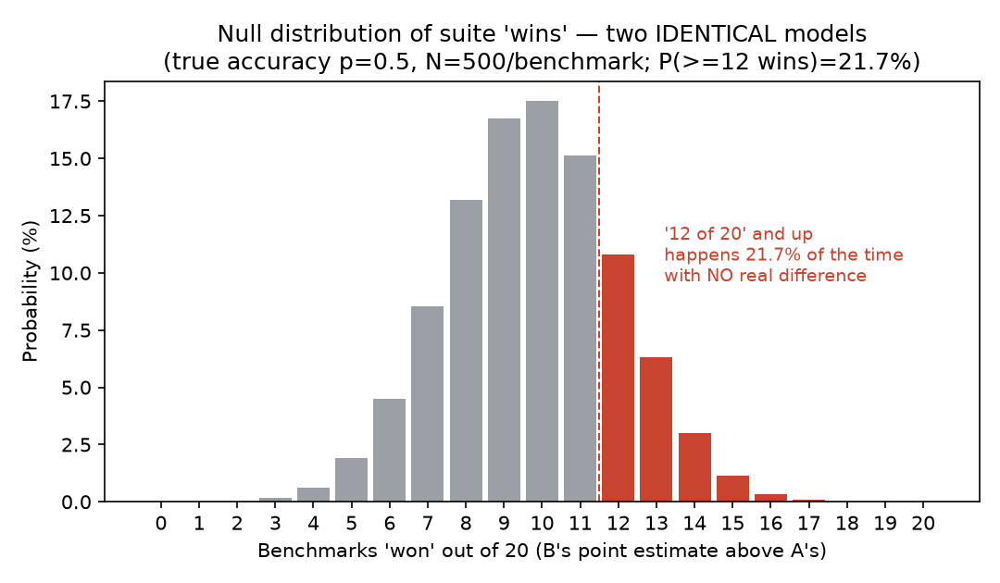

# Launch-blog figures — regenerated from the shipped tools

This file holds the two regenerated figures for the launch blog
**"Most reported eval 'wins' are noise — here's the data"**
(`01-blog-most-eval-wins-are-noise.md`). It replaces the two `[REGENERATE]`
markers in that draft with real output from the now-shipped tools, plus the
exact command + seed for each so the post can footnote them and anyone can
reproduce them end-to-end.

**Honest-numbers policy:** every number below is what the tools actually
produced. Where a regenerated number differs from what the draft's prose
assumed, it is flagged in **§3 Discrepancies vs the draft** rather than massaged
to fit. Keyless throughout — no API keys, no scraping, no PII.

Environment: `deltagate 0.1.1`, `siggate 0.1.1`, `leaderboard-ci` @
`e6f18ee` (branch `main`). numpy only for the exact/MC math; the gate numbers
come from the shipped `siggate` library; matplotlib only renders the PNG.

---

## Figure 1 — Null distribution of eval "wins" (replaces the Experiment 1 `[REGENERATE]`)

> Blog marker (Experiment 1): *"the distribution of 'benchmarks won out of 20'
> under the null, and the probability of ≥12 … pulled directly from the siggate
> simulation output."*

**Method.** Two models are pinned to *identical* true accuracy `p` on every
benchmark — there is no real difference to find. Per-benchmark scores are draws
of `Binomial(N, p)`. A benchmark is "won" (the press-release sense the blog
critiques) when model B's observed score is above model A's. Computed two ways
that agree: an **exact** lattice computation (convolution of two Binomials) and
a **seeded Monte Carlo** cross-check (200,000 trials). The "fix" rows then push
the *same* null draws through the **shipped gate** (`siggate.compare` /
`siggate.compare_suite`).

**Command (deterministic, seed = 20260615):**

```bash
cd significance-gate
uv run --with matplotlib python docs/launch_figures_sim.py
# writes docs/launch_figure1_null.json and docs/launch_figure1_null.png
```

Headline configuration: `p = 0.50` (maximum-variance null — the canonical
coin-flip, and the case that most favors spurious "wins"), suite of `K = 20`
benchmarks, `N = 500` items/benchmark, `alpha = 0.05`.

### 1a. Single benchmark — how often noise alone hands you a "win"

Under *zero* true difference, probability that B's observed score beats A's by
at least the stated margin (directional). Exact:

| N (items) | P(B beats A) | P(tie) | P(≥1pt "win") | P(≥2pt "win") |
|---:|---:|---:|---:|---:|
| 198 | 0.4800 | 0.0401 | **0.4401** | **0.3625** |
| 400 | 0.4859 | 0.0282 | **0.4023** | **0.2980** |
| 500 | 0.4874 | 0.0252 | **0.3880** | **0.2740** |

Robustness (higher-accuracy, lower-variance benchmark), `p = 0.75`, `N = 500`:
P(≥1pt win) = 0.3712, P(≥2pt win) = 0.2439 — same story, slightly smaller.

Monte Carlo cross-check at `N = 500` (200k trials): P(B beats A) = 0.4869,
P(≥1pt) = 0.3881, P(≥2pt) = 0.2729 — matches the exact column.

**Read:** on a 400-item benchmark, two *identical* models produce a ≥2-point
gap in a given direction **~30% of the time**, and a ≥1-point gap **~40%** of
the time. That is the noise floor a single reported delta sits on.

### 1b. Suite of 20 benchmarks — the "12 of 20" headline

Per-benchmark win probability `q = P(B > A) = 0.4874` (just under ½ because of
the small tie mass). Number of benchmarks won ~ `Binomial(20, q)`. Exact:

| Outcome | Probability |
|---|---:|
| Expected number of wins | **9.75 / 20** |
| P(≥11 wins — a strict majority) | 0.3681 |
| **P(≥12 wins — the "12 of 20" headline)** | **0.2168** |
| P(≥13 wins) | 0.1089 |
| P(≥14 wins) | 0.0457 |

Monte Carlo cross-check (200k trials): E[wins] = 9.745, P(≥12) = 0.2160,
P(≥11) = 0.3682.

**Read:** with **no real progress at all**, a "new model wins on 12 of 20
benchmarks" headline appears **~22% of the time** — roughly one model pair in
five. The full distribution is the PNG below.



*`docs/launch_figure1_null.png` — exact null distribution of "benchmarks won out
of 20" for two identical models (`p = 0.5`, `N = 500`). Red bars (≥12) sum to
21.7%.*

### 1c. The fix — the same null through the shipped gate

Running the identical null draws through `siggate` (paired test per benchmark;
Holm multiplicity correction across the suite):

| Quantity | Value | Note |
|---|---:|---|
| Per-benchmark false-positive (REAL) rate | **5.4%** | 2,000 null comparisons; target ≈ α = 5% |
| Per-benchmark labels | REAL 108 / UNDERPOWERED 1892 / NOISE 0 | at N=500, mei=0.05 the gate calls most nulls *underpowered*, not *real* |
| Naive (uncorrected) significant "wins" per 20-suite | mean 0.92 (max 4) | raw p<α false positives |
| Survivors after Holm correction per 20-suite | **mean 0.04 (max 1)** | the gate's actual output |
| Suites with **zero** false survivors | **96.0%** | over 200 suites |

**Read:** the naive point-estimate view manufactures a ~12-of-20 headline ~22%
of the time; the gate, on the same data, lets through **0.04 false "wins" per
20-benchmark suite** and clears the whole suite to zero **96%** of the time.
That gap *is* the product.

---

## Figure 2 — GPQA-Diamond is one statistical tie (replaces the Experiment 2 `[REGENERATE]`)

> Blog marker (Experiment 2): *"the specific model list, point scores, interval
> bounds, and the pairwise overlap matrix … regenerated from leaderboard-ci
> against the … GPQA-Diamond results."*

**Method.** `leaderboard-ci` on its **bundled** GPQA-Diamond sample (n = 198):
Wilson 95% confidence intervals per model, Benjamini–Hochberg–corrected pairwise
two-proportion tests, and "statistical tie band" grouping. Deterministic — no
seed (closed-form intervals on fixed data).

**Command:**

```bash
cd leaderboard-reliability
leaderboard-ci -b "GPQA Diamond"                 # table below
leaderboard-ci -b "GPQA Diamond" --format json   # full pairwise matrix
# full text output saved alongside: docs/launch_figure2_gpqa.md
```

### 2a. Per-model Wilson intervals and tie bands

3 tie bands at 95% CI · correction: BH · α = 0.05.

| Rank | Band | Model | Score | 95% CI (Wilson) | ±half | n |
|---:|:---:|:--|---:|:--|---:|---:|
| 1 | #1 | Claude Mythos Preview | 94.6 | [90.3, 96.9] | 3.3 | 198 |
| 2 | #1 | Gemini 3.1 Pro | 94.3 | [90.3, 96.9] | 3.3 | 198 |
| 3 | #1 | Claude Opus 4.7 | 94.2 | [90.3, 96.9] | 3.3 | 198 |
| 4 | #1 | Gemini 3.1 Pro Preview | 94.1 | [89.7, 96.5] | 3.4 | 198 |
| 5 | #1 | GPT-5.4 (xhigh) | 92.0 | [87.3, 95.0] | 3.8 | 198 |
| 6 | #2 | o1 | 78.0 | [71.5, 83.0] | 5.8 | 198 |
| 7 | #3 | Claude 3.5 Sonnet | 59.4 | [52.6, 66.2] | 6.8 | 198 |
| 8 | #3 | GPT-4o | 53.6 | [46.6, 60.3] | 6.9 | 198 |

The **top five models (92.0–94.6) are one tie band** — every CI overlaps every
other. Ranks 1–5 are not statistically distinguishable.

### 2b. Pairwise "not significant" matrix — within the top band

All **10** within-band pairs (BH-adjusted): **every one a tie**, none
significant.

| A | B | Δ (pts) | adj. p | significant? |
|:--|:--|---:|---:|:---:|
| Claude Mythos Preview | Gemini 3.1 Pro | 0.3 | 1.000 | no |
| Claude Mythos Preview | Claude Opus 4.7 | 0.4 | 1.000 | no |
| Claude Mythos Preview | Gemini 3.1 Pro Preview | 0.5 | 0.929 | no |
| Claude Mythos Preview | GPT-5.4 (xhigh) | 2.6 | 0.425 | no |
| Gemini 3.1 Pro | Claude Opus 4.7 | 0.1 | 1.000 | no |
| Gemini 3.1 Pro | Gemini 3.1 Pro Preview | 0.2 | 0.929 | no |
| Gemini 3.1 Pro | GPT-5.4 (xhigh) | 2.3 | 0.425 | no |
| Claude Opus 4.7 | Gemini 3.1 Pro Preview | 0.1 | 0.929 | no |
| Claude Opus 4.7 | GPT-5.4 (xhigh) | 2.2 | 0.425 | no |
| Gemini 3.1 Pro Preview | GPT-5.4 (xhigh) | 2.1 | 0.551 | no |

The largest gap inside the band — 2.6 points, the nominal "#1 vs #5" — clears
nothing: BH-adjusted p = 0.425. At 198 items, 2.6 points is ~5 questions, well
inside the noise.

**Provenance / honesty note on the data.** This is the tool's **bundled,
illustrative** sample (`src/leaderboard_ci/data/sample_leaderboard.csv`), so the
tool works out of the box. Per its `SOURCES.md`, the figures are compiled and
rounded public-style benchmark numbers and the model list includes
forward-dated / hypothetical builds (e.g. "Claude Mythos Preview", "Gemini 3.1
Pro"). The **statistics are real and reproducible**; the **input scores are
illustrative, not an authoritative current leaderboard.** For the published
post, either (a) present this as an illustrative re-analysis, or (b) re-run the
identical command on a CSV of current real GPQA-Diamond numbers
(`leaderboard-ci --input current_gpqa.csv -b "GPQA Diamond"`) — the method and
the conclusion ("198 items can't resolve a few points") hold either way.

---

## 3. Discrepancies vs the draft's placeholder prose

Flagged honestly rather than massaged:

1. **"'Wins on most benchmarks' is the expected result of comparing two
   identical models."** *Slight overstatement.* The **expected** number of wins
   is **9.75 / 20 — just under half** (point estimates rarely tie exactly, and
   the small tie mass pulls the expectation below 10). B winning a strict
   *majority* (≥11 of 20) happens **36.8%** of the time, not >50%. Suggested
   rewording: *"roughly half the benchmarks tip each way, and a clear-majority
   'won most of them' split shows up better than a third of the time — with zero
   real difference."* The core point stands; the word "expected" is the only
   thing that's literally off.

2. **"Getting '12 of 20' … is not a rare event under the null — it's an ordinary
   outcome."** *Supported, with a number.* P(≥12) = **21.7%** (≈ 1 in 5). Fair
   to call "not rare"; "ordinary outcome" is defensible but the modal outcome is
   9–10. Recommend citing the **21.7%** explicitly so readers see the magnitude.

3. **"A 2–3 point 'gain' on a 400-question benchmark is routinely within that
   interval … you'd see a gap that size, in that direction, a large fraction of
   the time."** *Supported.* At N = 400, a ≥2-point directional gain occurs
   **29.8%** of the time under the null (≥1-point: 40.2%). "Large fraction" is
   accurate; the post can cite ~30%.

4. **"The entire 92–95% band collapses into a single statistical tie … model A
   #1, model B #2, model C #3 is a coin sort."** *Supported, and slightly
   stronger than drafted.* The tie band is the **top five** models (92.0–94.6),
   not just three; all 10 within-band pairwise tests are non-significant. The
   draft's "1-2-3" example is a subset of a wider tie.

5. **GPQA-Diamond data is illustrative/bundled, not a live scrape.** The draft's
   marker said "against the *current* GPQA-Diamond results." The shipped tool's
   bundled sample is illustrative (see §2b note). Not a math discrepancy — a
   data-provenance caveat the published post must not paper over. Either label it
   illustrative or re-run on current real numbers via the same command.

6. **Gate false-positive nuance.** Under the null at N = 500 / mei = 0.05, the
   gate labels most non-significant comparisons **UNDERPOWERED** (1892/2000)
   rather than **NOISE** — because a 500-item benchmark can't resolve a 5-point
   minimum-effect-of-interest. The REAL (false-positive) rate is still **5.4% ≈
   α**, and post-correction survivors ≈ 0.04/suite. If the post says the gate
   returns "⚪ Noise" on the null, note that at this n it more often returns "🟡
   Underpowered" — which is arguably the *more* honest verdict and on-message.

---

## Reproducibility summary

| Figure | Command | Seed | Deterministic? |
|---|---|---|---|
| 1 (null sim) | `uv run --with matplotlib python docs/launch_figures_sim.py` | `20260615` | yes (exact + seeded MC + seeded gate) |
| 2 (GPQA) | `leaderboard-ci -b "GPQA Diamond" [--format json]` | n/a | yes (closed-form on fixed data) |

Artifacts in this repo: `docs/launch_figures_sim.py`,
`docs/launch_figure1_null.json`, `docs/launch_figure1_null.png`,
`docs/launch_figure2_gpqa.md`, and this file.
